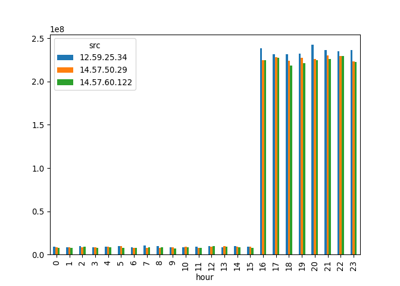

# Поиск утечки данных из сети
Илья Москалёв

## Задание

Другой атакующий установил автоматическую задачу в системном
планировщике cron для экспорта содержимого внутренней wiki системы. Эта
система генерирует большое количество траффика в нерабо- чие часы,
больше чем остальные хосты. Определите IP этой системы. Известно, что ее
IP адрес отличается от нарушителя из предыдущей задачи.

## Ход работы

Переведём дамп трафика в датафрейм Pandas:

``` python
import pandas as pd
from datetime import datetime
import numpy as np
df = pd.read_csv('traffic_security.csv',names=['timestamp','src','dst','port','bytes'])
```

Переведём дамп в часы:

``` python
df['timestamp'] = pd.to_datetime(df['timestamp'],unit='ms')
df['hour'] = pd.DatetimeIndex(df['timestamp']).hour
```

Отфильтруем трафик:

``` python
df_res = df.query('(hour < 8 | hour > 18) & src != "13.37.84.125"')
df_res = df_res.groupby(['src']).sum('bytes')
```

Получим ответ:

``` python
top_three = df_res.sort_values(by='bytes',ascending=False).head(3)
print(top_three['bytes']) #максимум трафика
```

    src
    12.59.25.34     1255293714
    14.57.50.29     1203005118
    14.57.60.122    1189892410
    Name: bytes, dtype: int64

Получим графическое представление ответа:

``` python
by_hour = df[df['src'].isin(top_three.index)].groupby(['src','hour']).sum('bytes')['bytes'].reset_index('src').pivot(columns='src',values='bytes') #почасовая сводка
by_hour.plot.bar()
```


